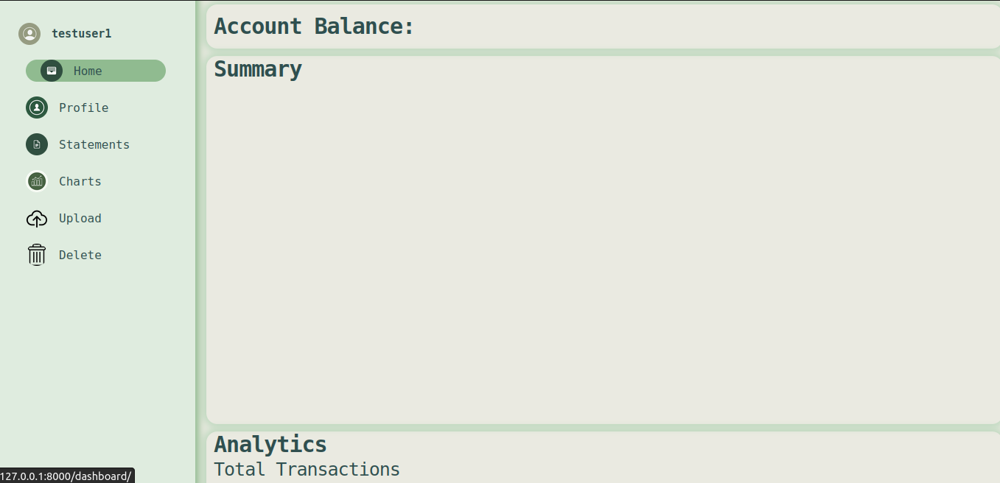
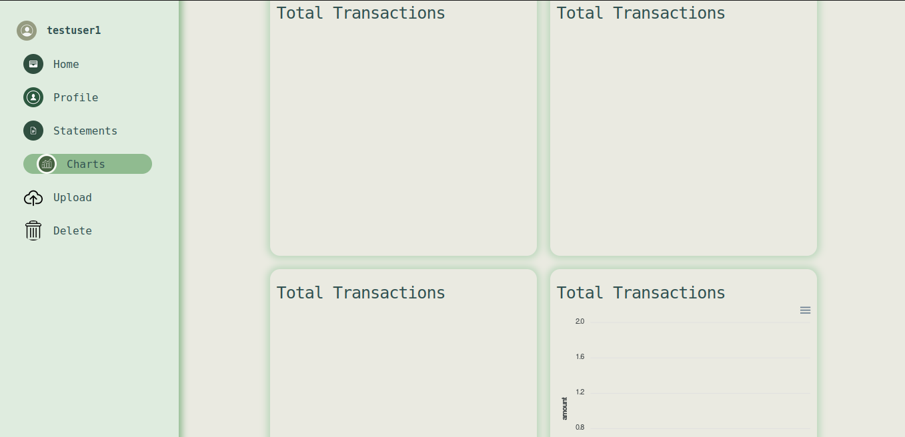

# PlanQuick

## What is PlanQuick
Planquick was a web app project collaboration between Charles and Stephanie. It was built on django framework for the back-end and html, css and js for the web application  front-end. sqlite was used for the application database. The web application was deployed to heruko.

## What it does
Planquick is a web application that helps user to track their mobile banking transactions. It has been designed for use with Safaricom Mpesa and MTN Momo service providers. The users need to upload a json file of their transaction data and all data is filtered and stored in a database. The data is dynanically populated in charts, statements and category totals. Users are allowed to delete their data via a delete button in the dashboard section.

## Installation instructions
For users wishing to directly use or customize the application.
1. Clone the project directory.

2. Navigate to the planquick directory.

3. Open terminal and install required dependencies using following command -

    pip install -r requirements.txt

4. Open terminal in directory where **manage** python file resides. And then execute following command -

    python manage.py runserver
    
5. Go to browser and hit following url -

    localhost:8000
    
## Usage
1. visit the planquick site.
2. Signup or login to the app.
3. Visit the upload section on the dashboard.
	
4. Upload your transactions json file and sit back as we dynamically serve your transactions.
5. You can view your data from dashboard, statements and charts section.
	
6. To delete all your data from the site just click on the delete button.

## Features
- Dasboard section with summaries
- Charts section with different types of charts.
- Statements section to show all transactions
- delete, to clear all user data
- profile page to update user details

## Future of planquick
- [ ] User budget creation
- [ ] simple checklist for your budget.
- [ ] dockerize the app

## Authors

- **Charles Gitahi** <[Chaloh](https://github.com/chaloh-debug)>
- **Stephanie Umutoni** <[Sumutoni](https://github.com/sumutoni)>
